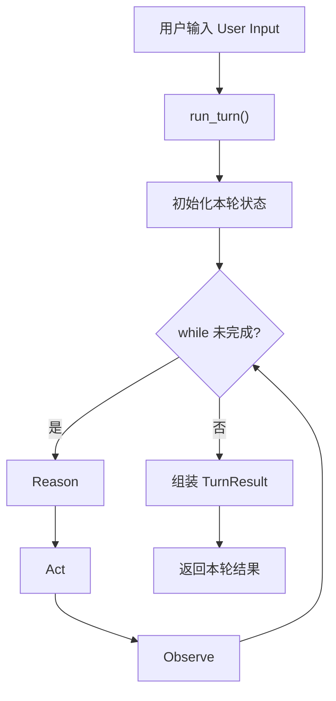

# 0006 如何理解 run_turn()、while loop 和 ReAct 的关系

## 问题

`run_turn()`、agent 最核心的 while loop，以及 ReAct，这三个概念分别是什么？它们之间是什么关系？

## 简短结论

可以先这样理解：

- `run_turn()`：一轮执行的外层入口
- while loop：这一轮内部反复迭代的执行发动机
- ReAct：这一轮内部采用的一种推理与行动策略

也就是说：

`run_turn()` 是容器，while loop 是执行循环，ReAct 是循环内部的一种工作方法。

## 系统化梳理

### 1. `run_turn()` 是什么

`run_turn()` 可以理解成：

“处理一次用户请求的主函数”

它关心的是：

- 输入是什么
- 一轮什么时候开始
- 一轮什么时候结束
- 最后返回什么结果

它更偏工程结构和系统边界。

### 2. while loop 是什么

agent 不像普通聊天程序那样只调用一次模型就结束。

很多 agent 在一轮内部会不断迭代：

1. 模型先思考
2. 判断是否需要工具
3. 调用工具
4. 观察工具结果
5. 再继续思考
6. 直到完成

这个“不断重复直到完成”的部分，通常就是大家说的核心 while loop。

### 3. ReAct 是什么

ReAct 是一种 agent 执行策略。

它的典型模式是：

- Reason
- Act
- Observe

也就是：

- 先推理
- 再行动
- 再观察结果
- 然后继续下一轮推理

所以 ReAct 回答的是：

“agent 在这一轮里面，应该按什么节奏工作？”

### 4. 三者关系

它们不是同一层概念。

- `run_turn()`：最外层，一轮请求的总入口
- while loop：中间层，这一轮内部的迭代机制
- ReAct：内层策略，这个迭代机制里的具体工作方式

## 最小结构图

## 对应到 Pony Agent

在 Pony Agent 里，后续大概会是这样：

- `run_turn()`：定义在 Rust runtime 中，作为一轮执行入口
- while loop：后续在 runtime 内部承接模型调用、工具调用和状态流转
- ReAct：可能作为第一版最自然的 agent 工作模式

也就是说：

我们不是先实现一个抽象的“ReAct 理论”，而是先实现：

1. 一轮执行入口
2. 一轮内部循环
3. 让这套循环按 ReAct 风格工作

## 常见误区

- 误区 1：`run_turn()` 就等于 ReAct
- 误区 2：while loop 就是整个 agent 系统的全部
- 误区 3：先讨论复杂策略，比先定义一轮执行边界更重要

## 后续值得继续学什么

- `run_turn()` 第一版应该有哪些输入和输出
- Rust 里怎样建模 `TurnResult`
- ReAct 如何和工具调用协议结合

## 可延展内容选题

- 公众号：`一张图讲清 AI Agent 的 run_turn、while loop 和 ReAct`
- 知乎：`AI Agent 里的 ReAct 到底是函数、循环，还是一种策略？`
