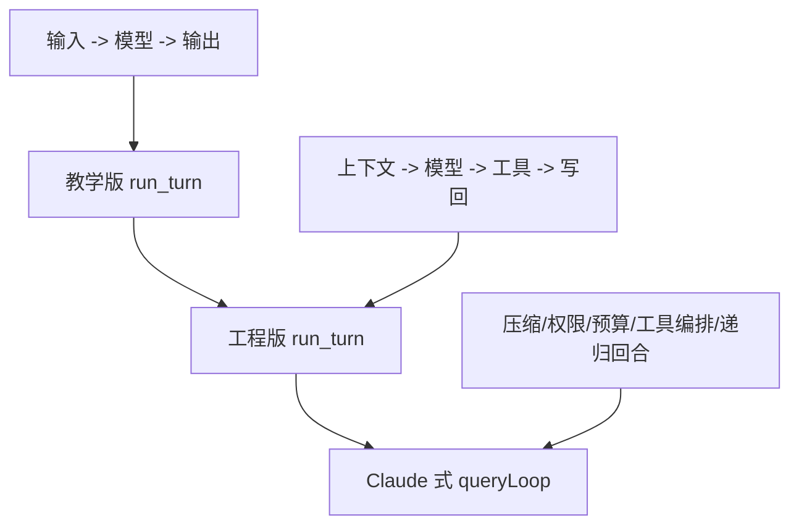

# 0002 run_turn 与 Claude queryLoop 的关系

## 这次要回答的问题

这次学习的核心问题是：

- 我们现在实现的 `run_turn()` 到底是不是 agent 的核心
- 它和 Claude Code 的核心机制是不是同一类东西
- 为什么我们现在先做简版，以后还会往里面加上下文、工具、记忆这些能力

## 先说结论

结论非常明确：

- 是的，`run_turn()` 就是 agent 核心回合机制的起点
- 是的，我们后面会不断往 `run_turn()` 里增加上下文处理、工具处理、记忆和状态控制
- 是的，这条路线和 Claude Code 的核心思想是一致的

差别不在“方向”，而在“复杂度”和“工程化程度”。

## Claude Code 里最接近 run_turn 的是什么

在这次对 `claude-code-sourcemap` 的阅读中，可以确认：

- Claude Code 里并没有一个就叫 `run_turn()` 的单独函数
- 它把这件事拆成了多个模块协作
- 其中最接近“核心回合循环”的，是 `query.ts` 里的 `query()` 和 `queryLoop()`

关键文件：

- `claude-code-sourcemap/restored-src/src/query.ts`
- `claude-code-sourcemap/restored-src/src/services/tools/toolOrchestration.ts`
- `claude-code-sourcemap/restored-src/src/services/tools/toolExecution.ts`
- `claude-code-sourcemap/restored-src/src/tools/AgentTool/runAgent.ts`

## 为什么说 queryLoop 本质上就是工业版 run_turn

因为它做的事情，和我们理解的 `run_turn()` 骨架完全同源：

1. 接收当前消息和上下文
2. 在发模型前做上下文处理
3. 调模型并流式接收输出
4. 判断有没有 `tool_use`
5. 如果有工具，就执行工具并生成 `tool_result`
6. 把这一轮的结果回写到会话
7. 决定是结束，还是继续进入下一轮

只是 Claude Code 把这一套做得更完整、更稳、更复杂。

## 我们现在做的为什么是简版

因为学习式重构最重要的是先打通主骨架，而不是一开始就把所有工业级能力堆进去。

如果一开始就同时做这些：

- 上下文裁剪
- 历史摘要
- 工具批处理
- 并发控制
- 权限检查
- 中断恢复
- hooks
- token budget
- 多代理递归

那会非常难学，也非常难调试。

所以我们现在先做的是一个“结构正确的第一版”。

## 简版 run_turn 应该包含什么

第一版最核心的是：

1. 输入用户消息
2. 组织本轮上下文
3. 调模型
4. 解析模型输出
5. 如果需要工具，执行工具
6. 生成结构化结果
7. 返回本轮状态

这个阶段的目标不是“功能最强”，而是“闭环清晰”。

## 后面会怎么演进

随着项目继续推进，`run_turn()` 会逐步吸收更多运行时能力。

### 第一层演进

- 更真实的消息结构
- 更明确的 `assistant / tool_use / tool_result`
- 更完整的 trace

### 第二层演进

- 上下文裁剪与摘要
- 会话记忆注入
- 工具路由与权限控制
- 可恢复状态

### 第三层演进

- 多工具批处理
- 并发安全判断
- 中断与恢复
- token budget 和 stop 条件
- 子代理 / 多代理回合

这条演进路径，本质上就是从“简版 run_turn”逐步走向“Claude 式 queryLoop”。

## 你可以怎样理解两者关系

最容易记忆的方式是下面这句：

`run_turn()` 不是和 Claude 不同的东西，而是 Claude 那套核心回合机制的低复杂度起步版。

也就是说：

- 我们不是先做一个玩具，再推倒重来
- 我们是在做一个可以持续生长的主骨架

## 一个三层对照

### 第 1 层：教学版

只有最小闭环：

- 用户输入
- 模型输出
- 可选工具调用
- 返回结果

### 第 2 层：工程版

开始加入：

- 上下文整理
- 工具结果写回
- 状态跟踪
- 多轮继续

### 第 3 层：工业版

像 Claude Code 一样继续加入：

- 压缩与摘要
- 并发工具执行
- 权限系统
- hooks
- token budget
- 记忆与附件
- 子代理和递归回合

## 一个简图

## 当前对 Pony Agent 的意义

对当前项目来说，这个认识非常重要：

- 我们现在可以放心做简版
- 但要从一开始就把结构设计对
- 后续新增能力时，应当是“往骨架里加模块”，而不是推翻骨架重写

这也解释了为什么 `run_turn()` 值得作为当前实现重点：它就是整个 agent runtime 的核心生长点。
